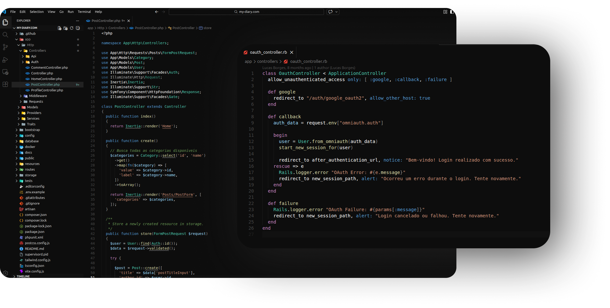

# Vantablack Material Dark

A VSCode theme that combines the ultra-dark background from Vantablack (inspired by [vantablack-vscode](https://github.com/bjarneo/vantablack-vscode)) with the syntax highlighting colors from Default Material Dark.

## Preview



## Installation

Launch VS Code Quick Open (Ctrl+P), paste the following command, and press enter.

```
ext install ruanSignori.vantablack-material
``` 


## License

MIT
